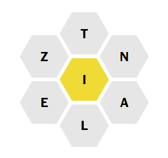

# New York Times "Spelling Bee" puzzle solver

USAGE: `spellingbee LETTERS [pivot]`

## Architecture

I challenged myself to find a somewhat clever or optimized way of solving [NYT's "Spelling Bee"](https://www.nytimes.com/puzzles/spelling-bee) daily challenge. The resulting architecture isn't the most optimal (though still rather performant) for solving a single NYT Spelling Bee puzzle, but is rather designed so that it builds a reusable map of the information needed to solve _multiple_ Spelling Bee (or other anagram-like puzzles) upon startup, after which it can service any number of different anagram/SB requests in an optimized fashion.

## Dictionary Word Factorization

At startup, the contents of the word file (currently just hard-coded to read the system dictionary from `/usr/share/dict/words`) are analyzed and each word is converted into its factors: the unique set of (lowercased) letters comprising the word, sorted by alphabetical order. As these factors do not by any means represent a unique fingerprint for each word and can repeat, the factors are deduplicated and words sharing factors are collapsed together.

A map between each of these unique factors and the words sharing the same factor (essentially, `HashMap<Factor, Vec<Word>>`) is generated in this process, and the map is persisted for the lifetime of the application. Until this point, nothing to do with the current puzzle has been taken into consideration and all the words in the dictionary have been factored.

## Servicing Anagram Puzzles

To solve a NYT Spelling Bee challenge (or any other anagram puzzle), the letters available for use are provided to the application (currently, via the command line at startup, but you can imagine a web page servicing these requests as well). 

We generate a set of all possible combinations (not permutations) of the input letters, for example so that when given a unique set of letters `{ A, B, C }`, we can find words with any of the factors `{ A }, { B }, { C }, { A, B }, { A, C }, { B, C }, { A, B, C }`. Each of these "subfactors" is looked up in the factor map, and from there we get a list of words matching each combination subfactor. For NYT Spelling Bee puzzles, there's the additional constraint that the central letter (hereafter called the "pivot") must be present in all solutions, so we drop or skip any subfactors that don't contain this pivot letter.

Now, armed with our map of all factors to dictionary words and a set of all possible combinations meeting our requirements that can be formed from the input letters, we just look up each of the subfactors in the list and add the resulting list of words to our list of correct answers.

# License, Copyright, and Authorship 

This code is released to the public under the terms of the MIT license. This project and documentation were written by Mahmoud Al-Qudsi. Any rights not conferred by the license are reserved under copyright.
